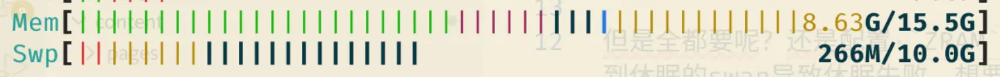

+++
date = '2025-11-01T21:57:31+08:00'
draft = true
title = '关于Linux的swap那些事情'
+++

## 引子

无论在哪个安装 Arch 的教程里面，你都能看到要求你设置一个 `swap` 分区，但是，这个分区真的那么有必要吗？

我最早听到 `swap` 这个字，大概是安卓 2.3-4.0 时代吧。那时候的 CPU 性能不行，存储性能也很差，但是人们却执着于把 `swap` 放在存储卡上面，总共 `128M` 的内存，要在卡上放 `64M` 进行交换。不过对于本来就慢的安卓手机，能够有更大的内存以便运行大型一点的游戏，就算慢一点，也比较值得。

然而在现代系统上面，手机厂商又把这个“内存拓展”拿出来，许多人对此嗤之以鼻，然而这完全不是一回事。

## 把内存变小，而不是放到低速存储上面

首先，能够实现这一切的前提，是内存虚拟化。

一个程序看到的大量的地址空间，其实并不是 1:1 的映射到物理内存上面的。通过系统调用 `mmap`，操作系统记录了一个程序看到的内存是怎么对应到物理内存上去，但是，为什么一定是物理内存上面呢？

于是有了 `swap`，当我内存不够的时候，直接把程序运行时的内存（匿名页）驱逐到 `swap` 上面，然后往映射表记录，当再次需要访问他的时候，触发一个“缺页中断”，就把 `swap` 的内存重新搬回物理内存上面，这一切对于程序来说都是透明的。

随着性能的发展，人们发现，这个把匿名页搬回物理内存的过程实在是太慢了，浪费了大量的 CPU 时间，那么为什么不让做点事情？于是，内存压缩出现了。

### ZRAM

`ZRAM`，顾名思义，就是把内存压缩。

不过，人们用的还是 `swap` 的那套思路，把内存中的一部分划分出来，然后创建一个块设备，然后需要的时候，把内存压缩进去，这就是 `ZRAM`。

我们可以通过 `swappiness` 参数，控制操作系统内核把内存压缩进入 `swap` 的激进性，现在的值取 `0-200` 了，值越高，越倾向于把内存放入交换分区。如果是传统的 `swap`，那么我们希望不要那么激进，因为磁盘总归是慢的；但是对于一个压缩的内存块来说，应该把这个值取很高，因为对于 `zstd` 和 `lz4` 这样的算法来说，压缩/解压的速度非常快。

#### 存到极限

如果内存的压力持续增大，`ZRAM` 会有用完的时候。这又分为两种情况：

#### 1. `ZRAM` 达到了设置的压缩前的数据的最大值。

这时候如果没有配置回写块的时候，系统就会去寻找一个优先级更低的 `swap` 了。如果没有，那么就很可能触发 `OOM`。

配置了回写块的话，`ZRAM` 会把其中最少使用的数据驱逐到回写块中。这个回写块跟 `swap` 是不相容的，只能用于一种用途。

如果这时候需要提取写入到回写块中的数据，那么就直接从磁盘解压到物理内存中，因为是压缩的数据，不仅减少了对磁盘的读写，还不让 CPU 闲着。

#### 2. `ZRAM` 还没满，但是物理内存就要满了

这种情况一般是 `ZRAM` 块最大值太高了。

同样也会造成 `ZRAM` 往回写块驱逐匿名页，但是如果回写块写入很慢造成了阻塞，同时内存占用还在增加，那么操作系统可能就触发 `OOM` 开始杀进程了。

### ZSWAP

还有另外一种技术，但是我之前都没听说过。

这项技术配置起来感觉更加 native 一点，因为是直接往内核参数里面写。

`ZSWAP` 其实不会创建一个块，但是需要 `swap` 的存在，当系统打算往 `swap` 里面写入数据的时候，`ZSWAP` 会拦截写入，然后进行压缩到内存中的一部分区域。

`ZSWAP` 同样会在内存压力高的时候驱逐匿名页到 `swap` 中，这一点跟 `ZRAM` 很像，从 `Linux 6.8` 开始，支持禁用回写块，仅仅用作内存压缩。

---

所以你会发现，`ZRAM` 加上了回写块，那么就是普通的 `ZSWAP`；如果 `ZSWAP` 禁用了回写块，那么就相当于一个普通的 `ZRAM`，从使用的角度，确实是这样的。

## 如何选择

既然这两者都可以在使用时相互替代，那么究竟如何选择呢？

我的推荐是，如果内存足够，也要使用休眠的设备，比如笔记本之类，使用 `ZSWAP` 并且禁用回写块。这样 `swap` 就专注于配置休眠，至于避免 `OOM` 来说，笔记本应该不会有需要很多内存的场景...吗？

如果服务器，或者高性能的PC，那么还是推荐使用 `ZRAM` 加上一个小 `SWAP`，这样可以很好的避免了内存使用的尖锋，也享受了内存压缩的红利。

但是全都要呢？还是配置 `ZRAM` 加上一个回写块，和一个休眠 `swap`。不过如果使用内存过多，还是会溢出到休眠的swap导致休眠失败。想要修改，可能得 HACK 一点的办法，在休眠前激活这个分区，然后再绕过检查...

不推荐同时使用 `ZSWAP` 和 `ZRAM`，这样会造成冲突。

---

两者有什么优势呢？

`ZSWAP`：管理起来更直观，因为是钩子，所以不会出现一个 `swap` 块。

`ZRAM`：不仅仅是内存压缩，实际上块设备可以格式化来存东西。

## 观察

这是一个 `ZSWAP` 的 `htop` 图，其中深蓝色的一部分就是 `ZSWAP` 做的事情。其中 `266M` 的大部分都是压缩在内存中的，不过显示在了 `swap` 中。

---

如果是一个 `ZRAM` 的设备，那么 `htop` 甚至可以单独调出一条来先是它，从观察角度来说，`ZRAM` 相对方便一些。