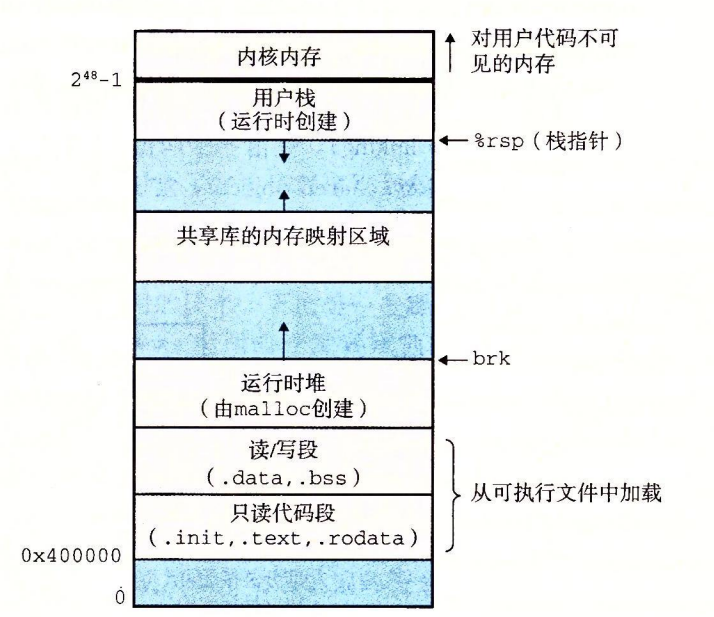

+++
date = '2025-11-19T15:54:44+08:00'
draft = true
title = 'Csapp'
+++

## ELF 的分布

- 段头部表：指示下面的各种段是如何加载进入内存的。（头）
- 节头部表：指示如何让动态链接的程序如何去加载共享库。（末尾）

`ELF` 中有一部分只读的，还有读写的部分。

只读：

- `.init`: 在程序运行前设置运行环境的代码部分。
- `.text`: 编译后的机器码。
- `.rodata`: 常量区，比如 `C-Style` 的字符串。

读写：

- `.data`: 存储已初始化的全局变量、静态变量。
- `.bss`: 可以认为是 `Better Save Storage`，因为放在此处可以减少 `ELF` 的体积。

---

> 使用 `readelf`，会发现这些段的加载到 `2MB` 的整数倍上，是为了内存对齐。
> 在 `ELF` 段头表上面，会看到 `vaddr` 和 `paddr`，一般只考虑前者。

在现代操作系统上面，使用 `PIE` (非位置无关可执行文件)，所以看到的是 4K 页的映射，已经没有物理地址的说明了。这样让加载器自动确定地址。

在读写的部分，会发现文件大小和加载后的内存大小不一致，因为 `bss` 段不会加载进去，而是预留八字节。

## 加载可执行目标文件

一个相比微机原理更加详细的内存布局图。

在 64 位系统上面， `2^48` 以上的部分保留给内核，`2^48-1` 部分是栈，向低地址增长，共享库位于堆和栈的中间。

## PIC (位置无关代码)

通过 `PIC`，可以实现不同的程序共用加载在同一段在内存中的共享库，从而节省空间。

在数据段开始的部分，添加一个 `GOT` 全局偏移表，这个表可以被动态链接器查找对应的共享库内存地址，从而使用共享库。