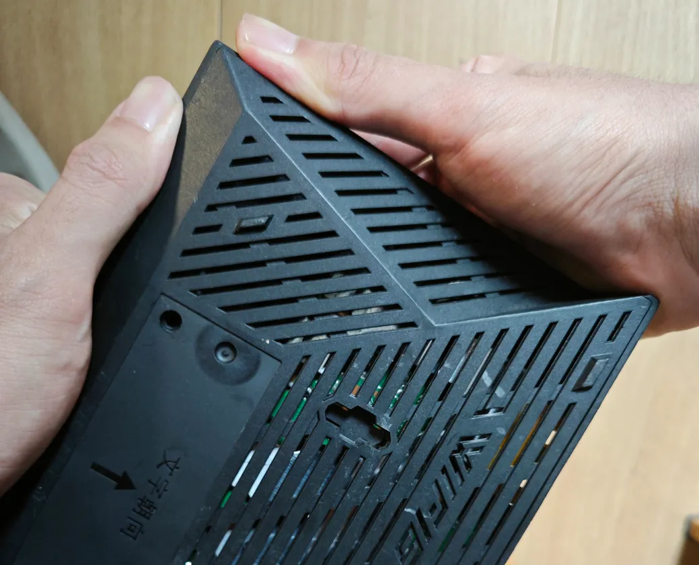

+++
date = '2025-07-12T13:47:15+08:00'
draft = false
title = '中国移动RAX3000Me USB3.0版折腾小记'
+++

## 前言

这几天在闲鱼蹲路由器，终于让我蹲到了一台65的RAX3000Me，遂开始折腾。

买之前看了下恩山发现可以免拆，无非就是导出导入配置文件破解ssh呗，但是到手之后，发现我大意了。

这台没法按照<cite>标准流程[^1]</cite>破解密码，通过爬帖得知，无法导出配置的自己的加密都存在问题，没办法免拆。

那？！CH340，启动！

## 刷写教程

教程大部分都是参考这篇文章，在此感谢。

[CMCC RAX3000Me可通过mtk_uartboot启动刷机，拆机刷OpenWRT/ImmortalWRT无障碍！](https://www.right.com.cn/forum/thread-8408539-1-1.html)

### 拆机

先把贴纸撕下来，拧下两颗螺丝。

左手握着长边，右手握着短边，像这样：



用力往下掰，会出现一条缝，用薄点的拆机片或者卡片撬开，小心别把卡扣弄断了。


拧下5颗螺丝，卸下散热片，上面涂有硅脂，要稍微移动一下散热片才好下来，装回去的时候得重新涂一下。

（其实不卸下也行，但是我探针就太难插了）

推一下下面和右边的卡扣，把主板撬出来，小心不要弄断天线连接处了。

你会看到这样：


电源线左边，分别是`GND` `TX` `3.3v` `RX`。

### 文件准备

准备好这些东西：


[天灵的U-Boot](https://www.right.com.cn/forum/thread-8400306-1-1.html)

[bl2](https://www.lanzouw.com/ioTYu1pvi23g) <cite>（预构建，也可自行编译）[^2]</cite>

[mtk_uartboot](https://github.com/981213/mtk_uartboot/releases/tag/v0.1.1)

打开你的`shell`，`cd`到此文件夹，连接你的CH340，你应该能在设备管理器看到对应的串口。我在Linux上面是`/dev/ttyUSB0`，如果你使用Windows，一般是`COMX`，请自行替换。

```shell
./mtk_uartboot -s /dev/ttyUSB0 -p ./mt7981-ddr3-bl2.bin -f mt7981-cmcc_rax3000me-nand-ddr3-fip-fit.bin --brom-load-baudrate 115200 --bl2-load-baudrate 115200 -a
```

> 这里要记得加`-a`，否则可能识别成aarch32导致超时。

这时候应该会提示：

```
mtk_uartboot - 0.1.1
Using serial port: /dev/ttyUSB0
Handshake...
```

准备完成！

### 刷入UBOOT

把你的CH340插上线，用杜邦线什么的都行，但是最好有带弹簧的测试探针，这是我的工具：


> 其实我还有一个更好的，放学校忘记拿回来了

> 这位兄弟由于5V对地短路已经似了，这是他的生前照片😭

找出CH340的`GND` `RX` `3V3` `TX`，从左往右依次按上主板的触点，这时候右手还可以操作电脑。(后面实测，不接3.3v也可以成功烧录，要接12v电源才能开始)

> 如果你不确定是否插好，可以退出mtk_uartboot，打开任意串口工具并连接，直接插电启动，应该能看到调试信息。

确认插好了，就直接上电，大概30秒左右，mtk_uartboot输出以下内容并交还shell：

```
mtk_uartboot - 0.1.1
Using serial port: /dev/ttyUSB0
Handshake...
hw code: 0x7981
hw sub code: 0x8a00
hw ver: 0xca00
sw ver: 0x1
Baud rate set to 115200
sending payload to 0x201000...
Checksum: 0x55cf
Setting baudrate back to 115200
Jumping to 0x201000 in aarch64...
Waiting for BL2. Message below:
==================================
NOTICE:  BL2: v2.10.0   (release):v2.4-rc0-5845-gbacca82a8-dirty
NOTICE:  BL2: Built : 20:18:08, Feb  2 2024
NOTICE:  WDT: Cold boot
NOTICE:  WDT: disabled
NOTICE:  EMI: Using DDR3 settings
NOTICE:  EMI: Detected DRAM size: 512MB
NOTICE:  EMI: complex R/W mem test passed
NOTICE:  CPU: MT7981 (1300MHz)
NOTICE:  Starting UART download handshake ...
==================================
BL2 UART DL version: 0x10
Baudrate set to: 115200
FIP sent.
==================================
NOTICE:  Received FIP 0x3df58 @ 0x40400000 ...
==================================
```

然后路由器就会亮起蓝灯（正常进官方系统没联网是红灯），网线插LAN口连到电脑，输入`192.168.1.1/uboot.html`，上传之前下载的uboot。

#### 一些问题

##### `mtk_uartboot`异常退出，提示coredump

这大概率是连接不好/接上了3.3v。建议不要接3.3v，否则每次连上都会导致CH340断开连接。

##### 无论怎么尝试，总是提示`Timeout waiting for specified message.`

有下面两种情况：

第一种：没有加`-d`参数。

```
Jumping to 0x201000 in aarch32...
Waiting for BL2. Message below:
==================================
==================================
Timeout waiting for specified message.
```

这就是默认使用了`aarch32`，请严格按照上面的命令执行！

第二种：没识别出内存。

```shell
==================================
NOTICE:  BL2: v2.10.0   (release):v2.4-rc0-5845-gbacca82a8-dirty
NOTICE:  BL2: Built : 20:20:25, Feb  2 2024
NOTICE:  WDT: Cold boot
NOTICE:  WDT: disabled
NOTICE:  EMI: Using DDR4 settings
NOTICE:  EMI: Detected DRAM size: 0MB
==================================
```

你的bl2用错了，请确认你的ddr类型，或者尝试另外一种ddr类型。

第三种：是`aarch64`，但是没有输出。

```
Jumping to 0x201000 in aarch64...
Waiting for BL2. Message below:
==================================
==================================
Timeout waiting for specified message.
```

可能是以下情况：

1. 自己编译的bl2没成功。
2. 下载中出现损坏。
3. 使用了immortalwrt官方的preloader，此文件我试了很多次都没成功，原因未知。


### 刷入固件

我没完全搞明白现在wrt的刷入逻辑，我第一次是这样的：

1. 从[firmware-selector](https://firmware-selector.immortalwrt.org/?version=24.10.2&target=mediatek%2Ffilogic&id=cmcc_rax3000me) 下载KERNEL。

2. 进入`192.168.1.1`，上传固件，自动重启，成功了应该是亮绿灯。`immortalwrt`的管理地址`192.168.1.1`，用户名`root`，密码无。

3. 再重新在系统更新里面刷写一次`sysupgrade`，这样就完成了。

理论上直接刷sysupgrade也是可以的，这个就自己尝试了，反正有不死U-Boot。

当然后面可以刷hanwckf的固件，那就自己折腾吧。


## 参考

[^1]: [Daniel-Hwang/RAX3000Me: RAX3000Me路由器开发与固件刷入详细教程](https://github.com/Daniel-Hwang/RAX3000Me)

[^2]: [MediaTek Filogic 系列路由器串口救砖教程 - 暗云 - 博客园](https://www.cnblogs.com/p123/p/18046679)

