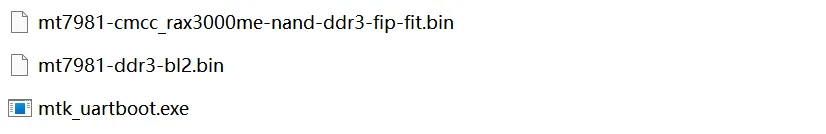

+++
date = '2025-07-12T13:47:15+08:00'
draft = false
title = '中国移动RAX3000Me USB3.0版折腾小记'
+++

## 前言

这几天在闲鱼蹲路由器，终于让我蹲到了一台65的RAX3000Me，遂开始折腾。

买之前看了下恩山发现可以免拆，无非就是导出导入配置文件破解ssh呗，但是到手之后，发现我大意了。

这台没法按照<cite>标准流程[^1]</cite>破解密码，通过爬帖得知，无法导出配置的自己的加密都存在问题，没办法免拆。

那？！CH340，启动！

## 刷写教程

### 拆机

先把贴纸撕下来，拧下两颗螺丝。

左手握着长边，右手握着短边，用力往下掰，会出现一条缝，用薄点的拆机片或者卡片撬开，小心别把卡扣弄断了。

拧下5颗螺丝，卸下散热片，上面涂有硅脂，可能要稍微移动一下散热片才好下来。

（其实不卸下也行，但是我探针就太难插了）

推一下rj45的卡口，把主板撬出来，小心不要弄断天线连接处了。

你会看到这样：


电源线左边，分别是`GND` `TX` `3.3v` `RX`。

### 文件准备

准备好这些东西：



[U-Boot](https://github.com/Daniel-Hwang/RAX3000Me/tree/main/20241111-RAX3000Me_Step12-TelnetUboot)

[bl2](https://www.lanzouw.com/ioTYu1pvi23g) <cite>（预构建，也可自行编译）[^2]</cite>

[mtk_uartboot](https://github.com/981213/mtk_uartboot/releases/tag/v0.1.1)

打开你的`shell`，`cd`到此文件夹，连接你的CH340，你应该能在设备管理器看到对应的串口（我是COM3），请自行替换。

```shell
.\mtk_uartboot.exe -s COM3 -p .\mt7981-ddr3-bl2.bin -a -f .\20250415_RAX3000me-nand-ddr3_HY_uboot.bin --brom-load-baudrate 115200 --bl2-load-baudrate 115200
```

这时候应该会提示：

```
mtk_uartboot - 0.1.1
Using serial port: COM3
Handshake...
```

准备完成！如果在连接路由器的时候CH340接触不好，可能会导致mtk_uartboot退出，请重新执行命令。

### 刷入UBOOT

把你的CH340插上线，用杜邦线什么的都行，但是最好有带弹簧的测试探针，这是我的工具：


> 其实我还有一个更好的，放学校忘记拿回来了😭

找出ch340的`GND` `RX` `3V3` `TX`，从左往右依次按上主板的触点，这时候右手还可以操作电脑。

> 如果你不确定是否插好，可以退出mtk_uartboot，打开任意串口工具并连接，直接插电启动，应该能看到调试信息。

确认插好了，就直接上电，大概30秒左右，mtk_uartboot输出以下内容并交还shell：

```
PS D:\UserData\Desktop\mtk> .\mtk_uartboot.exe -s COM3 -p .\mt7981-ddr4-bl2.bin -a -f .\20250415_RAX3000me-nand-ddr3_HY_uboot.bin --brom-load-baudrate 115200 --bl2-load-baudrate 115200
mtk_uartboot - 0.1.1
Using serial port: COM3
Handshake...
hw code: 0x7981
hw sub code: 0x8a00
hw ver: 0xca00
sw ver: 0x1
Baud rate set to 115200
sending payload to 0x201000...
Checksum: 0x48b7
Setting baudrate back to 115200
Jumping to 0x201000 in aarch64...
Waiting for BL2. Message below:
==================================
NOTICE:  BL2: v2.10.0   (release):v2.4-rc0-5845-gbacca82a8-dirty
NOTICE:  BL2: Built : 20:20:25, Feb  2 2024
NOTICE:  WDT: Cold boot
NOTICE:  WDT: disabled
NOTICE:  EMI: Using DDR4 settings
NOTICE:  EMI: Detected DRAM size: 0MB
==================================
Timeout waiting for specified message.
PS D:\UserData\Desktop\mtk> .\mtk_uartboot.exe -s COM3 -p .\mt7981-ddr3-bl2.bin -a -f .\20250415_RAX3000me-nand-ddr3_HY_uboot.bin --brom-load-baudrate 115200 --bl2-load-baudrate 115200
mtk_uartboot - 0.1.1
Using serial port: COM3
thread 'main' panicked at src\main.rs:143:17:
Failed to open port: Error { kind: NoDevice, description: "拒绝访问。" }
note: run with `RUST_BACKTRACE=1` environment variable to display a backtrace
PS D:\UserData\Desktop\mtk> .\mtk_uartboot.exe -s COM3 -p .\mt7981-ddr3-bl2.bin -a -f .\20250415_RAX3000me-nand-ddr3_HY_uboot.bin --brom-load-baudrate 115200 --bl2-load-baudrate 115200
mtk_uartboot - 0.1.1
Using serial port: COM3
Handshake...
hw code: 0x7981
hw sub code: 0x8a00
hw ver: 0xca00
sw ver: 0x1
Baud rate set to 115200
sending payload to 0x201000...
Checksum: 0x55cf
Setting baudrate back to 115200
Jumping to 0x201000 in aarch64...
Waiting for BL2. Message below:
==================================
NOTICE:  BL2: v2.10.0   (release):v2.4-rc0-5845-gbacca82a8-dirty
NOTICE:  BL2: Built : 20:18:08, Feb  2 2024
NOTICE:  WDT: Cold boot
NOTICE:  WDT: disabled
NOTICE:  EMI: Using DDR3 settings
NOTICE:  EMI: Detected DRAM size: 512MB
NOTICE:  EMI: complex R/W mem test passed
NOTICE:  CPU: MT7981 (1300MHz)
NOTICE:  Starting UART download handshake ...
==================================
BL2 UART DL version: 0x10
Baudrate set to: 115200
FIP sent.
==================================
NOTICE:  Received FIP 0x3df58 @ 0x40400000 ...
==================================
PS D:\UserData\Desktop\mtk>
```

然后路由器就会亮起蓝灯（正常进官方系统没联网是红灯），网线插LAN口连到电脑，输入`192.168.1.1/uboot.html`，上传之前下载的uboot。

### 刷入固件

我没完全搞明白现在wrt的刷入逻辑，不过这样是可以的：

1. 从[immirtalwrt selector](https://firmware-selector.immortalwrt.org/?version=24.10.2&target=mediatek%2Ffilogic&id=cmcc_rax3000me) 下载KERNEL。

2. 进入`192.168.1.1`，上传固件，自动重启，成功了应该是亮绿灯。`immortalwrt`的管理地址`192.168.1.1`，用户名`root`，密码无。

3. 再重新刷写一次`sysupgrade`，这样就完成了。

当然后面可以刷hanwckf的固件，那就自己折腾吧。


## 参考

[^1]: [Daniel-Hwang/RAX3000Me: RAX3000Me路由器开发与固件刷入详细教程](https://github.com/Daniel-Hwang/RAX3000Me)

[^2]: [MediaTek Filogic 系列路由器串口救砖教程 - 暗云 - 博客园](https://www.cnblogs.com/p123/p/18046679)

[^3]: [CMCC RAX3000Me可通过mtk_uartboot启动刷机，拆机刷OpenWRT/ImmortalWRT无障碍！](https://www.right.com.cn/forum/thread-8408539-1-1.html)
