+++
date = '2025-10-04T16:45:12+08:00'
draft = false
title = '搭建基于VSCode的跨平台C++学习环境'
+++

## 前言

早期学习C/C++是非常痛苦的，不仅被老师要求下载20G的宇宙IDE VS，还得自己格式化代码，这就是我一开始对此不感冒的原因。

但是随着学的东西多了，不写代码也不行啊，我才渐渐发现有那么多强大的工具我不知道。

所以这里记录一下自己的折腾过程，希望能帮到初学C++的朋友们。

## 准备

由于我主要是在ArchLinux上面学习，偶尔会在Windows上面测试，这里大部分内容都会在Linux上面完成，不过别担心，这些工具都是跨平台的。

### Linux

很简单，直接安装这些软件包：

- **Clang**  LLVM的前端，包括了Clangd即语言服务器
- **GCC/LLVM** 编译器
- **CMake** 依赖管理/构建系统
- **Ninja** 构建器

### Windows

推荐用`scoop`一键解决，对于这些命令行工具可以说非常方便了。

需要安装的包：

- **llvm-mingw** 包含了clangd/clang了
- **CMake**
- **Ninja**

如果想`GCC`的话，可以到[WinLibs](https://winlibs.com/)下载：


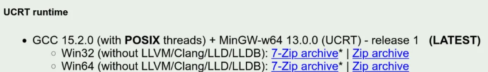

一般来说下`UCRT`就行了，从`win10`之后都支持`UCRT`的。

---

安装VSCode不用多说了吧？

安装这些拓展：

- `CMake Tools`
- `Clangd`
- `CodeLLDB`

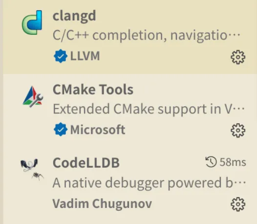

### CMake拓展设置

按照如图显示的配置`CMake`生成的数据库文件，以便后续的`Clangd`查找。

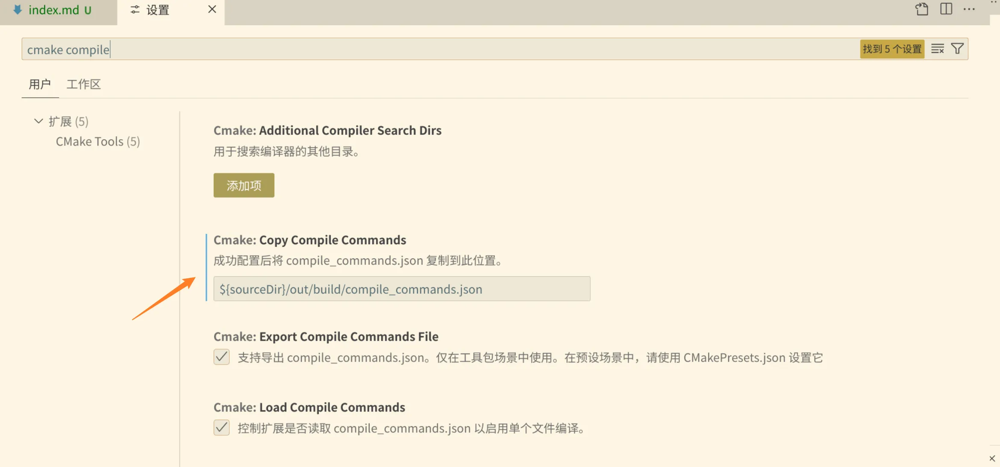

### Clangd拓展设置

填入`Clangd`寻找数据库的位置

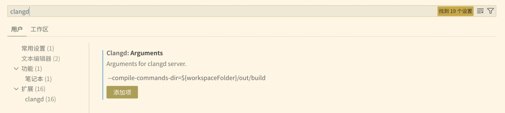

### CodeLLDB 拓展设置

安装完可能会下载一个调试包，对网络环境要求较高，如果遇到问题可以参考[这篇](https://zhuanlan.zhihu.com/p/566365173)文章。

## 创建项目

### 配置CMake

在你的项目根文件夹建立一个主`CMakeLists.txt`,内容可以这么写：

```cmake
set(CMAKE_EXPORT_COMPILE_COMMANDS ON)
# 最低 CMake 版本要求
cmake_minimum_required(VERSION 3.31)

# 项目名称和语言
project(learnproj VERSION 1.0 LANGUAGES CXX)

# 设置 C++ 标准
set(CMAKE_CXX_STANDARD 20)
set(CMAKE_CXX_STANDARD_REQUIRED ON)
set(CMAKE_CXX_EXTENSIONS OFF)


file(GLOB SUB_PROJECT_DIRS LIST_DIRECTORIES true ${CMAKE_CURRENT_SOURCE_DIR}/src/*)

# 遍历所有找到的目录
foreach(SUB_DIR ${SUB_PROJECT_DIRS})
    # 检查该目录下是否存在 CMakeLists.txt 文件
    if(IS_DIRECTORY ${SUB_DIR} AND EXISTS "${SUB_DIR}/CMakeLists.txt")
        # 将该目录名打印出来，方便调试
        get_filename_component(PROJECT_NAME ${SUB_DIR} NAME)
        message(STATUS "Found and added subproject: ${PROJECT_NAME}")

        # 将这个文件夹作为一个子项目添加进来
        add_subdirectory(${SUB_DIR})
    endif()
endforeach()


## 根据需要按需添加

# # 查找 Qt 库
# find_package(Qt6 REQUIRED COMPONENTS Core Gui Widgets)

# 添加可执行文件

# # 链接 Qt 库
# target_link_libraries(MyQtProject PRIVATE Qt6::Core Qt6::Gui Qt6::Widgets)

# # 自动处理 MOC、UIC 和 RCC
# set_target_properties(MyQtProject PROPERTIES
#     AUTOMOC ON
#     AUTOUIC ON
#     AUTORCC ON
# )
```

你可以根据自己的需要，设置C++标准，扫描的文件夹，链接的库。这里就以`src`目录放置源文件，`include`放置头文件为例。

进入`src/current`创建一个子`CMakeLists.txt`，内容写上：

```cmake
get_filename_component(PROJECT_NAME ${CMAKE_CURRENT_SOURCE_DIR} NAME)

## 如果你需要添加别的源文件，别忘了在这里添加文件名，空白符为分隔。
add_executable(${PROJECT_NAME} main.cpp 
                                )

if(MSVC)
    target_compile_options(${PROJECT_NAME} PRIVATE /W4 /WX)
else()
    ## 非MSVC指定一些警告参数
    target_compile_options(${PROJECT_NAME} PRIVATE 
        -Wall 
        -Wextra 
        -Wpedantic 
        # -Werror 
        -Wconversion
    )
endif()

## 这里指定的头文件的路径

target_include_directories(${PROJECT_NAME} PRIVATE ${CMAKE_CURRENT_SOURCE_DIR}/../../include/${PROJECT_NAME})
```

创建一个`main.cpp`，内容可以为空，你的项目应该这样：

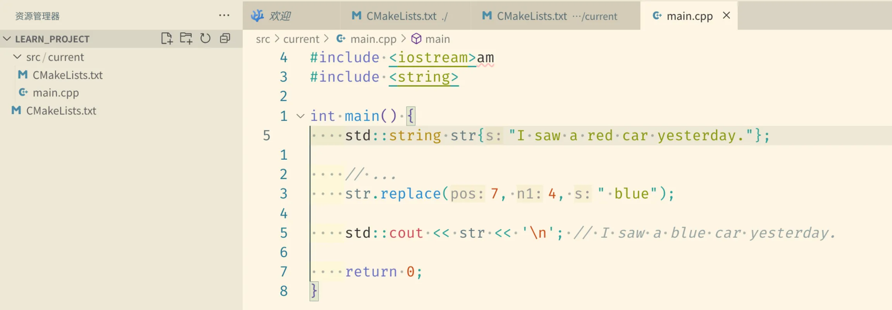

---

接着我们给`CMake`生成一些预设。

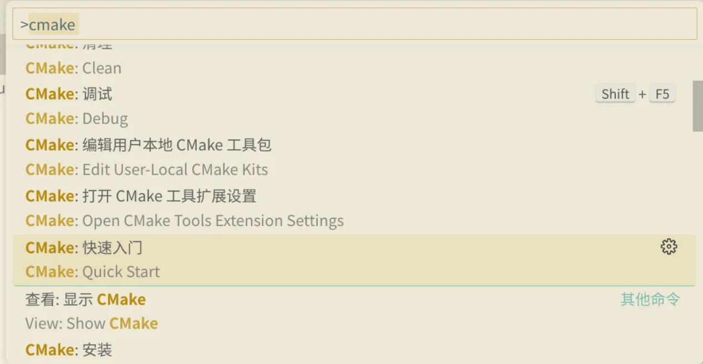

快速入门-添加新预设-从编译器创建

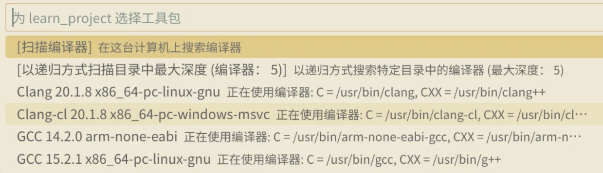

你如果只装了`Clang`，那么用不带`cl`的就行，同样也可以用`GCC`，看个人喜好。

输入名字，这里我是用`平台-编译器-构建器-版本`来命名的，回车会自动生成一个`CMakePresets.json`，像这样：

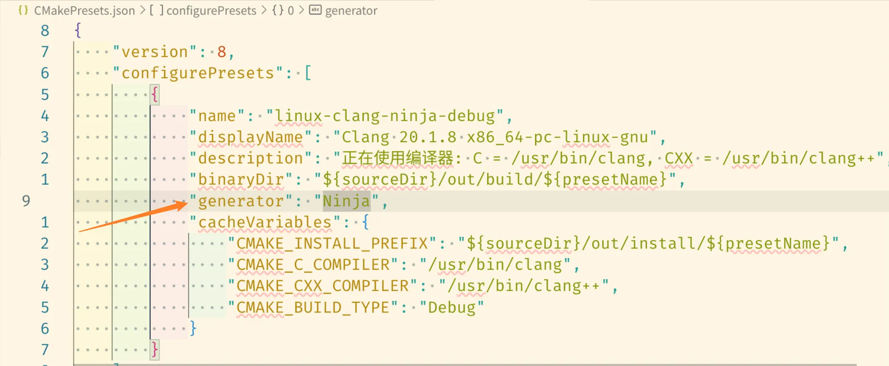

因为我比较喜欢`Ninja`，所以加入这一行。如果你想用`Make`，那么记得手动安装。

然后在这里添加新生成预设，从配置预设中构建，名字可以是构建预设后面加上`-build`。

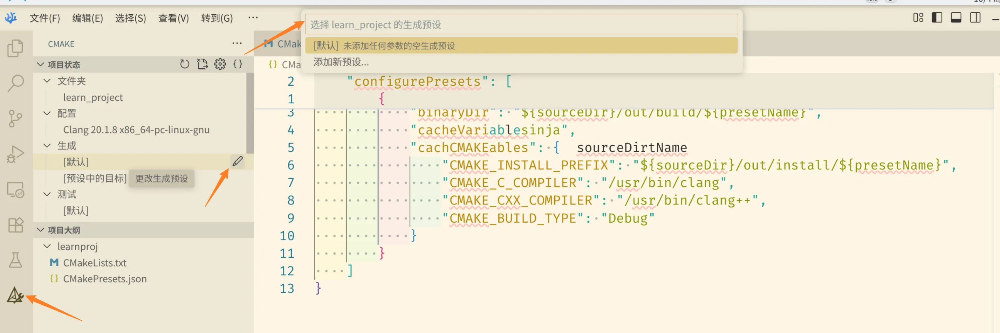

然后在这里选一下就好了：

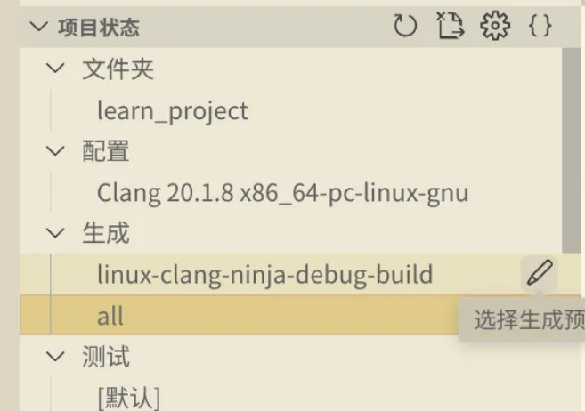

下面的生成目标可以选择你的文件夹名称了：

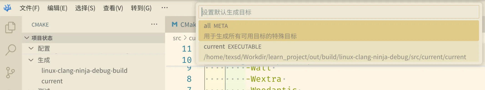

打开你的`main.cpp`，看看`clangd`怎么样？原来已经成功加载数据库并运行了：

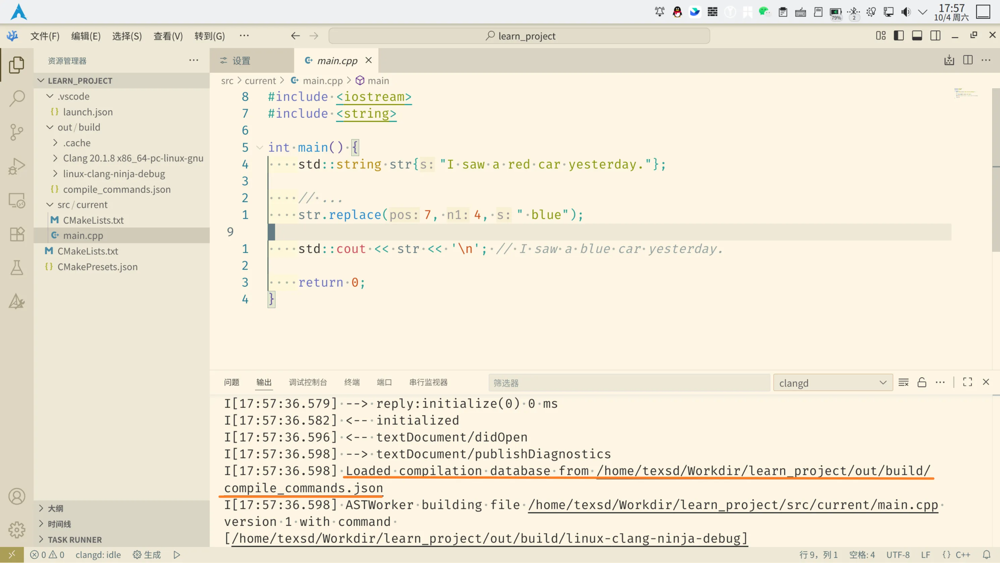

随便写点东西，然后点击左下角的生成，启动，你的代码应该可以运行了。

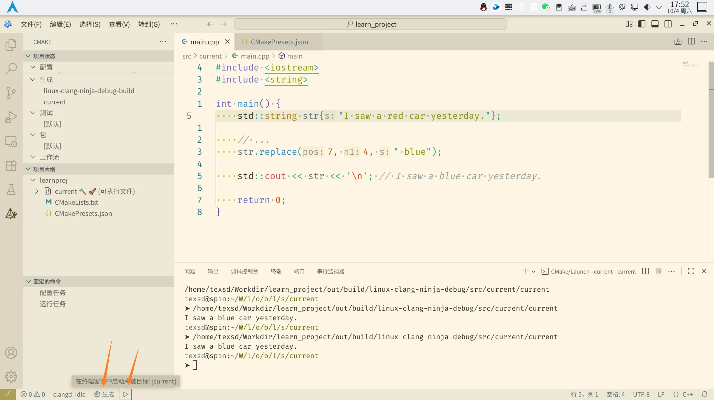

### 配置task

有人说，哎，我的<key>F5</key>一键调试呢？

在`.vscode/`下创建一个`launch.json`，写上：

```json
{
    "version": "0.2.0",
    "configurations": [
    
        {
            "type": "lldb",
            "request": "launch",
            "name": "Debug",
            "program": "${command:cmake.launchTargetPath}",
            "args": [],
            "console": "integratedTerminal",
            "cwd": "${workspaceFolder}",
        },
        
    ]
}
```

大功告成！

## 后续

### 格式化

你可能对于`Clangd`的格式化不太满意，那么可以在项目根目录创建一个`.clang-format`的文件，里面写上你想要的风格，具体可以去搜一下。

这是我的：

```yaml
# .clang-format
# 使用 LLVM 风格作为基础，这是很常见的风格
BasedOnStyle: LLVM
# 强制缩进宽度为 4 个空格
IndentWidth: 4
# 强制指针和引用靠左
PointerAlignment: Left
# 强制使用空格进行缩进，而不是制表符
UseTab: Never
```

### 其他

如果想添加头文件，直接往`include/<你的项目名字>`放置即可。

如果觉得项目不错，想保留代码，直接把`current`文件夹复制一份，改个名，运行的时候到`CMake`里面切换配置/生成目标就好。

如果你想用`MSVC`，那么可以下`VS Installer`，里面只选构建工具，不过注意这样是没法生成`compile_commands.json`给`Clangd`读取的。