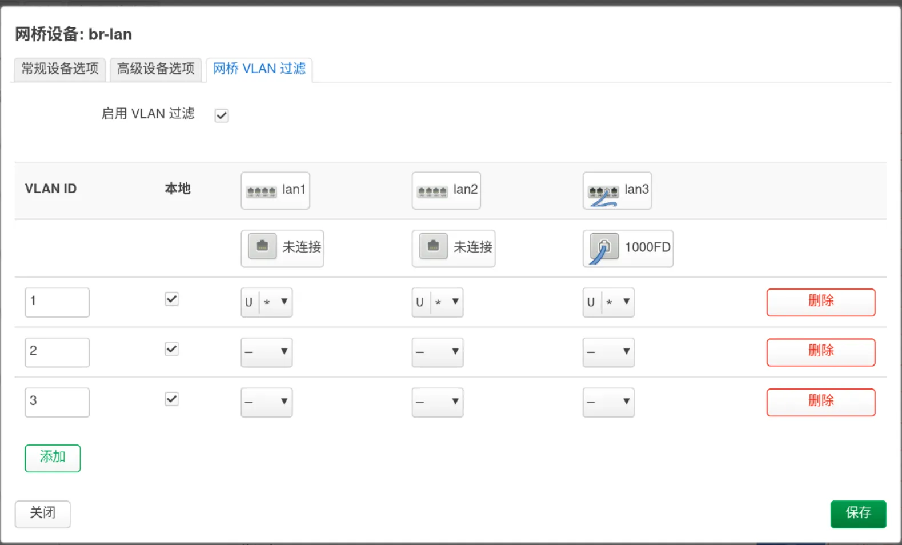

## 前言

早年接触过 wrt，但是那时候用的还是 7621 的设备，使用 mtk 开源驱动后信号会变得非常差，闭源驱动会出现死机的情况。如今入手 7981 的路由器，终于可以研究一下配置以及日用了。

## IPv6 上网

想让路由器下面的设备上网，无非就这么几种方式：

- PD(Prefix Delegation): 上级下发 ipv6 的/56 或者/60 的前缀，可以自己划分子网使用。

- NDP Proxy: 上级通过 SLAAC 分配 ipv6 地址，只开启了 O 标志，获得一个/64 的地址的时候使用。

- NPTv6: 你有多条宽带，需要做负载均衡。

- NAPTv6: 上级只允许通过 DHCPv6 获取地址（一般是学校之类需要强管理或者认证的场景），获得一个/128 的地址。

> 欸，这时候有人问，/128 不是也可以使用 ndp 代理吗？

理论上确实可行，但是很多 DHCPv6 服务器并不支持代理获取，下面这个`tcpdump`结果说明了这一点：

```
root@ImmortalWrt:~# tcpdump -i eth1 udp port 546 or udp port 547
tcpdump: verbose output suppressed, use -v[v]... for full protocol decode
listening on eth1, link-type EN10MB (Ethernet), snapshot length 262144 bytes
15:03:40.878466 IP6 fe80::aaaa.546 > ff02::1:2.547: dhcp6 solicit
15:03:40.880132 IP6 fe80::bbbb.547 > fe80::aaaa.546: dhcp6 advertise
15:03:42.905527 IP6 fe80::aaaa.546 > ff02::1:2.547: dhcp6 request
15:03:42.908198 IP6 fe80::bbbb.547 > fe80::aaaa.546: dhcp6 reply
15:04:39.149414 IP6 ImmortalWrt.lan.547 > ff05::1:3.547: dhcp6 relay-fwd
15:04:40.188299 IP6 ImmortalWrt.lan.547 > ff05::1:3.547: dhcp6 relay-fwd
15:04:42.189520 IP6 ImmortalWrt.lan.547 > ff05::1:3.547: dhcp6 relay-fwd
```

使用 ff05 的广播根本就不回你。

### NDP 代理

在路由器上面这样设置：

1. `wan6`

DHCP 服务器-IPv6 设置：

- 指定的主接口（打勾）
- RA 服务：中继模式
- DHCPv6 服务：中继模式
- NDP 代理：中继模式
- 学习路由（打勾）

2. `br-lan`

DHCP 服务器-IPv6 设置：

- 指定的主接口（不允许选择了）
- RA 服务：中继模式
- DHCPv6 服务：中继模式
- NDP 代理：中继模式
- 学习路由（打勾）
- NDP 代理从属设备（打勾）

这样操作相当于透传了上级路由的 RA（路由器通告），上面怎么样配置，你的局域网设备就是怎么样的，没法更改，当然如果你能获取到/64 的前缀，那么下面的设备一般来说也没有问题。

### 前缀下发

这当然是最推荐的方式了。

在现代的类 wrt 上面，使用`PPPoE`在 wan 口上拨号，同时在高级设置里面开启获取 IPv6 地址为自动，如果你的 ISP 有 IPv6 支持，会自动产生一个虚拟动态接口`wan_6`。一般这个接口能获取到一个/64 的地址和 IPv6-PD，这是我们能分配的前提条件。

我的配置是这样的：

- RA 服务：服务器模式
- DHCPv6 服务：已禁用
- NDP 代理：已禁用

#### 使用简单的路由通告配置

在家用的小型网络中，完全可以做到不架设 DHCPv6 服务器，只通过 RA 就可以实现基本的配置了，请看这个包：

```shell
root@t-router:~# tcpdump -nvi br-lan ip6[40] == 134
tcpdump: listening on br-lan, link-type EN10MB (Ethernet), snapshot length 262144 bytes
10:35:28.476086 IP6 (flowlabel 0x4f20d, hlim 255, next-header ICMPv6 (58) payload length: 144) fe80::aaaa > ff02::1: [icmp6 sum ok] ICMP6, router advertisement, length 144
        hop limit 64, Flags [none], pref medium, router lifetime 1800s, reachable time 0ms, retrans timer 0ms
          source link-address option (1), length 8 (1): aa:aa:aa:aa:aa:aa
          mtu option (5), length 8 (1):  1492
          prefix info option (3), length 32 (4): 2409:xxxx:xxxx:13a::/64, Flags [onlink, auto], valid time 5400s, pref. time 2700s
          route info option (24), length 24 (3):  2409:xxxx:xxxx:130::/60, pref=medium, lifetime=1800s
          rdnss option (25), length 24 (3):  lifetime 1800s, addr: 2409:xxxx:xxxx:13a::1
          dnssl option (31), length 24 (3):  lifetime 1800s, domain(s): lan.
          advertisement interval option (7), length 8 (1):  600000ms
```

几个重要的信息全部体现在这个里面了：
1. 地址：

没有配置 Flag，说明是 Stateless，设备自己生成配置，是否开启 RFC4941（隐私地址）由设备自己决定。

不过无状态自动配置要求地址的前缀必须是/64 以上的，否则会破坏这一行为。

2. 网关：

规定路由通告必须使用 fe80 开头的本地地址来发送路由通告，只要路由存活时间不为 0，那么下面的设备就可以使用这个地址当做默认路由。

2. DNS

- 使用`rdnss option`来配置 DNS。

Windows 在大概 1709 这个版本之后支持`rdnss`了，其他系统应该都支持吧？

- 使用`dnssl option`来配置 DNS 搜索域。

这个感觉意义不大，因为使用 DHCPv6 才会解析主机名.lan，这个使用 DHCPv4 已经足够了。

不过注意不要设置成.local，因为 mDNS 会使用这个域名导致冲突，而 mDNS 会自动发现的。

如果你有/60 的前缀，可以在高级设置里面填写 IPv6 分配提示，4 位正好可以填一位 16 进制数，`0-f`，以此类推/56 可以填两位，从而划分多个 IPv6 子网。

像我就是填了`a`。

#### 使用 DHCPv6

如果设备比较老，可能还是得开启 DHCPv6，办法就是把 DHCPv6 服务设置成服务器模式。

这时候就可以在 RA 设置里面的 RA 标记开启几个选项，让设备使用 DHCPv6 服务，这里配置项目已经讲解得很明白，我就不多说了，直接贴上来：

```shell
RA 标记

受管配置 (M)
受管地址配置 (M) 标记表明可以通过 DHCPv6 获取 IPv6 地址。
其他配置 (O)
其他配置 (O) 标记表明其他信息，如 DNS 服务器，可以通过 DHCPv6 获得。
移动家乡代理 (H)
移动 IPv6 家乡代理 (H) 标记表明该设备在此链路上还充当移动 IPv6 家乡代理。
```

DHCPv6 还可以配置别的一大堆东西，比如 NTP 之类的，但是 v4 已经干了这一堆了，我觉得除非 v4 被完全替代，否则现阶段完全没有理由用。

### NPTv6/NAPTv6

如果有多条宽带并且都有 PD，你可以内网分配一个 ULA 地址，然后在路由的时候进行前缀转换，这也是我们学校社团网络的做法。这种办法对于性能要求的不高，本身也算符合 IPv6 的实践。

---

但是如果你只能通过 DHCPv6 配到一个/128 的地址，那就没办法了，直接用动态地址伪装（masquerade）吧，一般的路由器都不会有硬件加速，所以网速不太行，但是如果是 IPv6 刚需也没有别的办法了。

我有点懒得写了，想用的可以参考[南航校园网 OpenWRT 配置 IPv6 NAT6](https://blog.creedowl.com/posts/ipv6_and_nat6_in_nuaa/)，我自己在学校里面配的过程已经忘记了，不过跟这个应该大差不差。

### 邻居协议

IPv6 相比 v4 的 b 就是不同，就是邻居协议取代 ARP，RA 实现了 DHCP 的基本功能。

路由器和客户端使用 NS（Neighbour Solicitation）和 NA（Neighbour Advertisement）来检测地址冲突，探测别的设备。

一个 SLAAC 的过程具体是这样：

1. 连接到网络，先生成一个地址，用`::`发送到这个地址，看自己生成的`fe80::/16`有没有冲突，没有就使用。
2. 向`ff02::`发送 RS，寻找路由器。
3. 路由器默认会每隔几分钟发送 RA，接收到 RS 后，会尽快回复 RA 消息。
4. 客户端自己生成一个全球唯一的可路由地址，然后再看有没有冲突，没冲突就开始使用这个地址上网。

## VLAN 划分

出于管理需要，我决定在路由器上面划分 VLAN 了，不过我其实并没有另一台 VLAN 的交换机，所以说并不是满血的 VLAN。同时由于是新手，对于 VLAN 的理解肯定有不到位之处，请多包涵。

### 简单的概念

- trunk：在这个通道上面跑的是打上不同 ID 的 VLAN。
- access：某个端口，一般来说一个端口只分配给一个 VLAN ID。

在某个端口上面，选择了 VLAN ID，有不同的标志可以分配：

- 不属于：这个 VLAN 不分配到这个端口。
- tagged：通过这个端口的数据包，都会被打上这个 VLAN 的 ID。
- untagged：通过这个端口的数据包，如果有 VLAN ID，将会被删除掉。
- 是主 VLAN：如果从这个接口进来的数据包没有任何标记，就认为他是这个 VLAN ID 的。

### 划分

我的想法是，`.1`的网段分配给熟悉的设备上网，`.2`的网段分配给物联网设备，`.3`的网段分配给访客网络。

所以我在设备上的`br-lan`的网桥 VLAN 过滤是这么配置的：



这个本地指的是路由器的 CPU 可以识别这个 VLAN 的内容，从而对它进行设置 DHCP 服务器之类的操作。

路由器有三个口，我全部分配给了 VLAN1，同时设置为主 VLAN 接口（显示为*），这是因为我大概不会在这上面接物联网设备（因为都是 2.4G 的设备）和插入访客的网线。

这时候在接口里面就可以看到这些虚拟的 VLAN 设备了，为它们设置 DHCP 服务器，防火墙，保存。

在无线里面，可以创建很多个同频段的 SSID（不会有人才知道吧），但是信道是一样的，接口配置里面可以选择关联的网络，这里选上你设置防火墙的接口，这时候通过这个 SSID 收到的数据就会自动地被交换机打上 VLAN ID 了。

在防火墙里面可以做更加细致的管理，比如使用`conntrack`，只允许 LAN 区段的设备主动发起到 IOT 设备的连接，隔离访客网络和信任网络的区段，非常灵活。

这时原有配置使用`br-lan`的应用，记得修改为`br-lan.1`。

> 这里有一个我刚开始不明白的问题：
> 外部网络根本不识别 VLAN ID，那么转发到 WAN 的流量为什么会自动把 VLAN 头给去掉呢？

其实不是主动去掉的，因为 VLAN 是二层的东西，路由（三层）和 VLAN 是两个相对独立的过程，跨局域网的时候需要换二层封装，所以 VLAN ID 自然没有了。