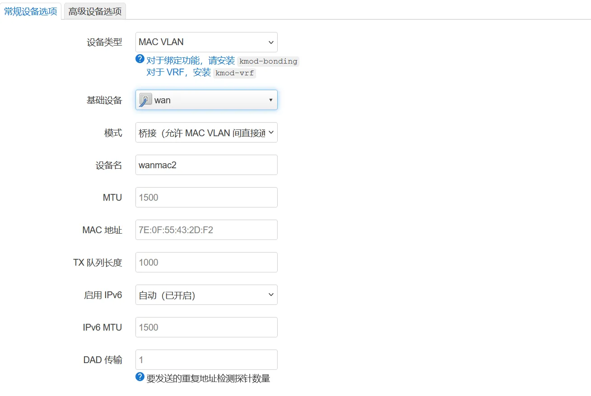
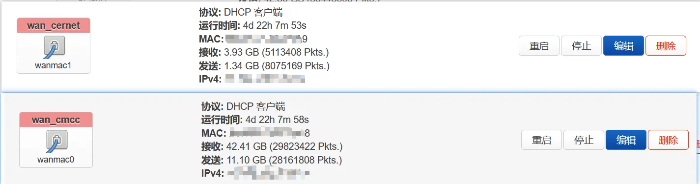
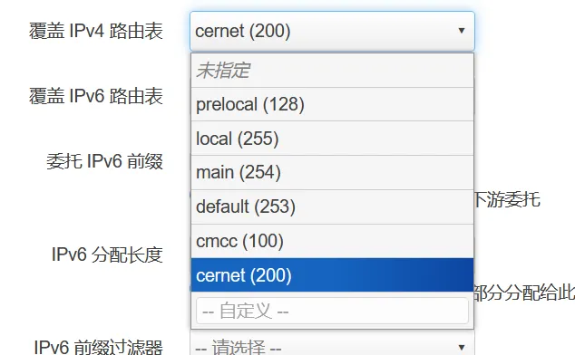

+++
date = '2026-01-07T01:42:21+08:00'
draft = false
title = 'Immortalwrt 折腾日记（2）'
+++

## 配置多线多内网

现在我同时有了两个账号的使用权，一个是运营商账号，有 IPv6，但是速度不算快，不过不断网；另一个是运营商自建的网，卖给学生用的，没有 IPv6，晚上11点半还断网，真是花钱做大冤种啊哈哈！

那么就有了配多内网的想法，之前也划过 VLAN 了，这里就不赘述了，提一嘴怎么给电脑网卡变成 trunk 模式，Win 就是在设备管理器，网卡的高级设置里面填入 ID，Linux 先modprobe 8021q，用 `nmcli` 可以添加子接口，具体看一下 manual。

在接口-设备这里，可以创建 MAC VLAN:

需要注意的是，在这台京东云上面要求多个 MACVLAN 必须是连续的，否则可能出现设备 CLAIM 失败的报错。

然后使用 `curl --interface `分别给每个接口配置 portal 认证。现在应该有两个接口了：

这时候会自动把两个 wan 口下发的路由都加到 main 表里面，是什么顺序我没注意，不过，你的设备肯定只走一条出去，另一条是闲置的。

所以我们要在高级设置里面覆盖 IPv4 路由表，这个的意思是把获取到的路由加到这个表里面。

表分两种，有名字的和纯数字 ID 的。你这里只能填 ID，填完了可以到 `/etc/iproute2/rt_tables` 里面按照 `id 名字` 这样写，这时候就更加有可读性。

/etc/iproute2/rt_tables 必须是连续的，否则可能出现设备 CLAIM 失败的报错。

然后使用 `curl --interface `分别给每个接口配置 portal 认证。现在应该有两个接口了：

这时候会自动把两个 wan 口下发的路由都加到 main 表里面，是什么顺序我没注意，不过，你的设备肯定只走一条出去，另一条是闲置的。

所以我们要在高级设置里面覆盖 IPv4 路由表，这个的意思是把获取到的路由加到这个表里面。

表分两种，有名字的和纯数字 ID 的。你这里只能填 ID，填完了可以到 `/etc/iproute2/rt_tables` 里面按照 `id 名字` 这样写，这时候就更加有可读性。

那么我就把两个路由分到了两个路由表里面，一个 cmcc，另一个 cernet。

这时候问题来了，你多半发现上不了网了，原因是默认只会查主路由表（main），这时候主路由表里面只有你的内网 local 路由，发往别的网段的数据包就被丢弃了。

所以我们得手动定制路由规则，其实对应的就是 `ip rule` 命令了。

按照不同的网段查不同的表，请注意上面两条规则很重要，要不然内网的流量也被发到 wan 口去了，wrt 系不像 routeros，没有靠 MAC 地址连接的办法，自动回滚居然也不生效，没备份的我至少重新弄了三遍。

然后就可以爽用了。

## tailscale 出现的问题

配完过了几天发现外部的 tailscale 没法连到内网的设备了，tcpdump 一看，只有访问的包，没有回去的包。我当时以为是 masquerade 的问题，在 ts 接口上面开了动态伪装，然后 dump br-lan.2，发现其实内网有回复，但是发到路由器后就没下文了。

我立马就知道肯定是路由规则问题了，防火墙没问题。

于是添加了一条最优先的规则，让目标为 `100.64.0.0/10' 的走主路由表，还是不通。

其实还是先入为主了！ts 自己弄了个 52 的路由表，他的规则全部在里面，根本不在主路由表。高级设置里面表填上 52，收工！